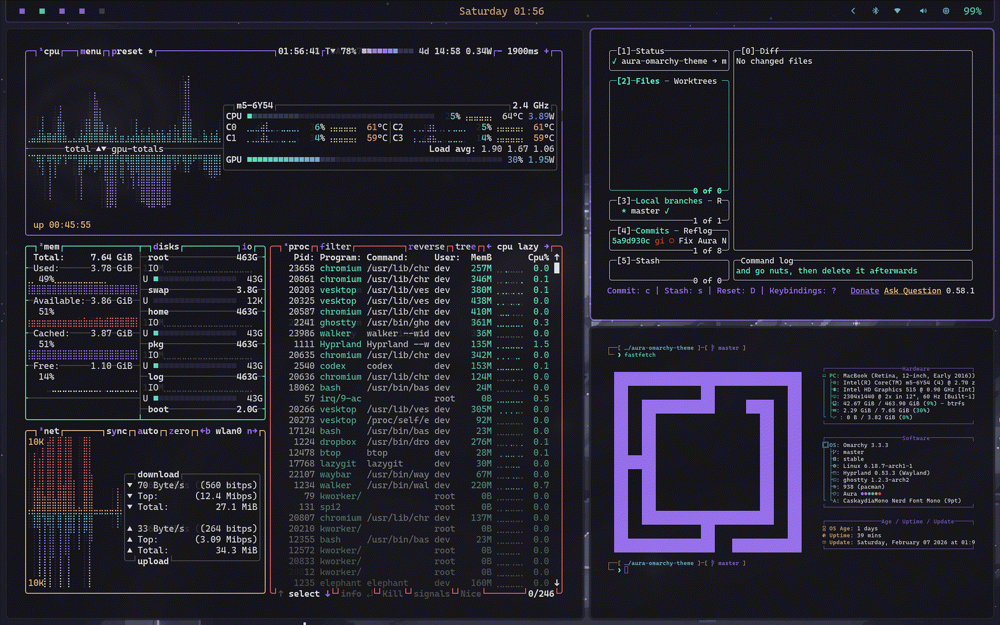
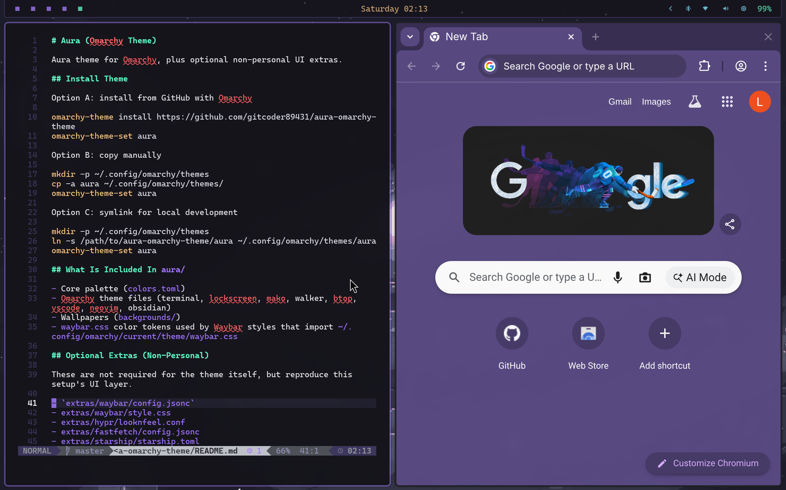

# Aura (Omarchy Theme)

Aura theme for Omarchy.

## Screenshots




## Install Theme

Option A: install from GitHub with Omarchy

```bash
omarchy-theme-install https://github.com/gitcoder89431/omarchy-aura-theme
omarchy-theme-set aura
```

Option B: copy manually

```bash
mkdir -p ~/.config/omarchy/themes/aura
rsync -a --delete \
  --exclude '.git' \
  --exclude 'README.md' \
  --exclude 'aura-*.png' \
  --exclude 'extras' \
  /path/to/aura-omarchy-theme/ ~/.config/omarchy/themes/aura/
omarchy-theme-set aura
```

Option C: symlink for local development

```bash
mkdir -p ~/.config/omarchy/themes
ln -s /path/to/aura-omarchy-theme ~/.config/omarchy/themes/aura
omarchy-theme-set aura
```

## What Is Included

- Core palette (`colors.toml`)
- Omarchy theme files (terminal, lockscreen, mako, walker, btop, vscode, neovim, obsidian, hyprland)
- Wallpapers (`backgrounds/`)
- `waybar.css` theme colors + bar container styling used by Waybar styles that import `~/.config/omarchy/current/theme/waybar.css`

## Optional Extras

These are optional add-ons to reproduce this setup's full UI layer.
The theme itself already applies Hyprland rounding, terminal opacity, and Waybar container styling.

- `extras/waybar/config.jsonc`
- `extras/waybar/style.css`
- `extras/hypr/looknfeel.conf`
- `extras/fastfetch/config.jsonc`
- `extras/starship/starship.toml`

ThemeManager+ compatibility layout is also included:

- `waybar-theme/config.jsonc`
- `waybar-theme/style.css`
- `starship.toml`

Apply extras:

```bash
mkdir -p ~/.config/hypr ~/.config/fastfetch
cp -a extras/waybar ~/.config/
cp extras/hypr/looknfeel.conf ~/.config/hypr/looknfeel.conf
cp extras/fastfetch/config.jsonc ~/.config/fastfetch/config.jsonc
cp extras/starship/starship.toml ~/.config/starship.toml
omarchy-restart-waybar
hyprctl reload
```

Preview Walker selection contrast (invert style):

```bash
./scripts/walker-demo.sh
```

## Notes

- Repo is intentionally flat (theme files at repo root) so `omarchy-theme install` works out of the box.
- Keep monitor layout (`~/.config/hypr/monitors.conf`) machine-specific.
- Tune palette in `colors.toml`.
